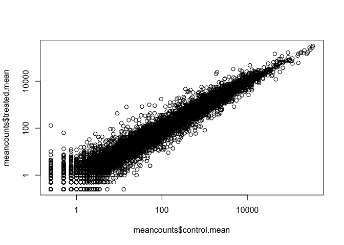

Class15: Genome Informatics II
================

RNA-seq analysis
----------------

First step is to read out countData and colData (metadata) files that we will use with DESeq

``` r
counts <- read.csv("data/airway_scaledcounts.csv", stringsAsFactors = FALSE)
metadata <- read.csv("data/airway_metadata.csv", stringsAsFactors = FALSE)
```

Lets examine the metadata file to find **control** and **treated** columns (cell-lines).

``` r
control.inds <- metadata$dex == "control"
control <- metadata[control.inds, ]
control
```

    ##           id     dex celltype     geo_id
    ## 1 SRR1039508 control   N61311 GSM1275862
    ## 3 SRR1039512 control  N052611 GSM1275866
    ## 5 SRR1039516 control  N080611 GSM1275870
    ## 7 SRR1039520 control  N061011 GSM1275874

``` r
control.mean <- rowSums( counts[ , control$id] )/4
names(control.mean) <- counts$ensgene
```

Do the same thing for the treated columns.

``` r
treated.inds <- metadata$dex == "treated"
treated <- metadata[treated.inds, ]
treated
```

    ##           id     dex celltype     geo_id
    ## 2 SRR1039509 treated   N61311 GSM1275863
    ## 4 SRR1039513 treated  N052611 GSM1275867
    ## 6 SRR1039517 treated  N080611 GSM1275871
    ## 8 SRR1039521 treated  N061011 GSM1275875

``` r
treated.mean <- rowSums( counts[ , treated$id] )/nrow(treated)
names(treated.mean) <- counts$ensgene
```

We will combine our meancount data for bookkeeping purposes.

``` r
meancounts <- data.frame(control.mean, treated.mean)
colSums(meancounts)
```

    ## control.mean treated.mean 
    ##     23005324     22196524

Lets plot our data.

``` r
plot(meancounts$control.mean, meancounts$treated.mean)
```


Plot but with log transformation.

``` r
plot(meancounts$control.mean, meancounts$treated.mean, log="xy")
```

    ## Warning in xy.coords(x, y, xlabel, ylabel, log): 15032 x values <= 0
    ## omitted from logarithmic plot

    ## Warning in xy.coords(x, y, xlabel, ylabel, log): 15281 y values <= 0
    ## omitted from logarithmic plot


